# Getting Started with Create React App

If you want to run this projects you should install node package then use npm run its run on your browser

## What I for making this

    * react
    * react-router-dom
    * bootstrap
    * reactstrap
    * remixicon
    * react-slick
    * slick-carousel
    * react-redux
    * react-paginate
    * reduxjs/toolkit

## Projects Images

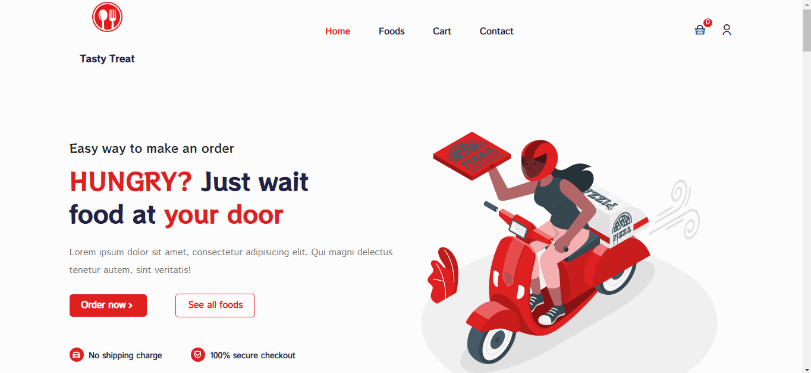
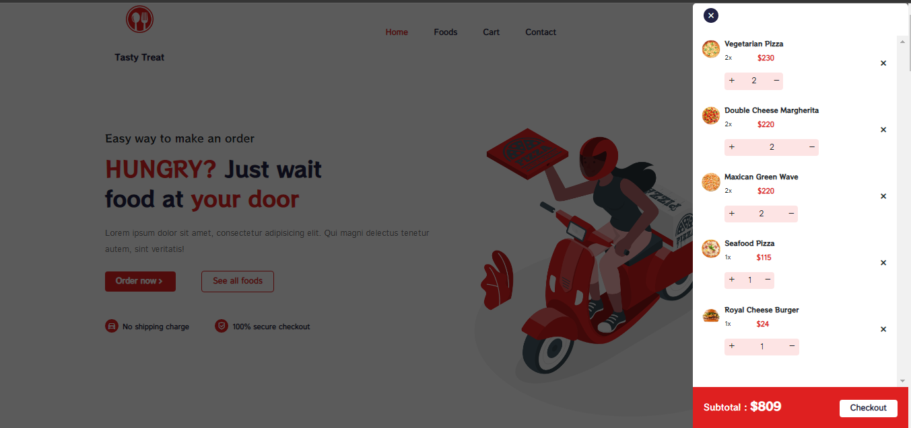
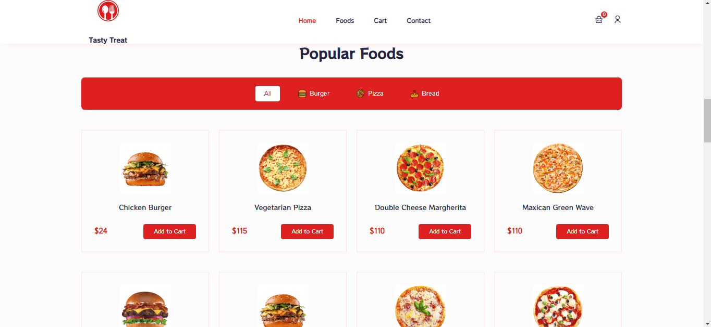
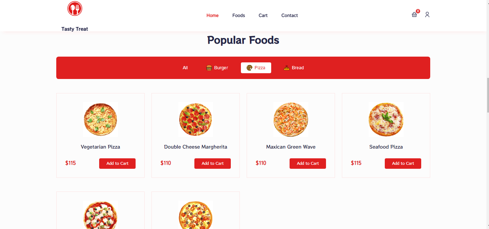
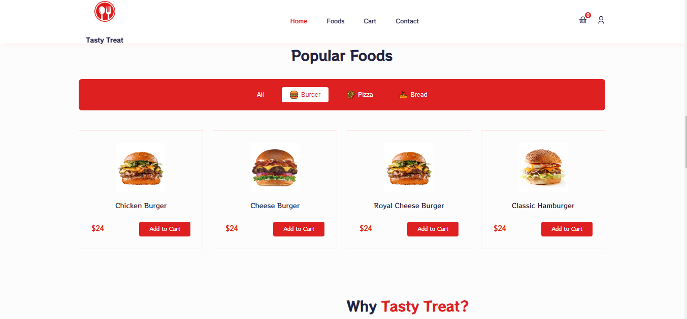
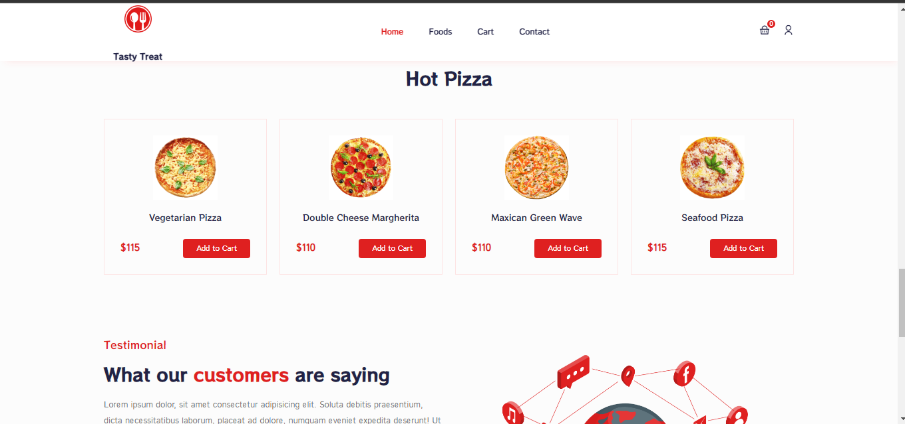
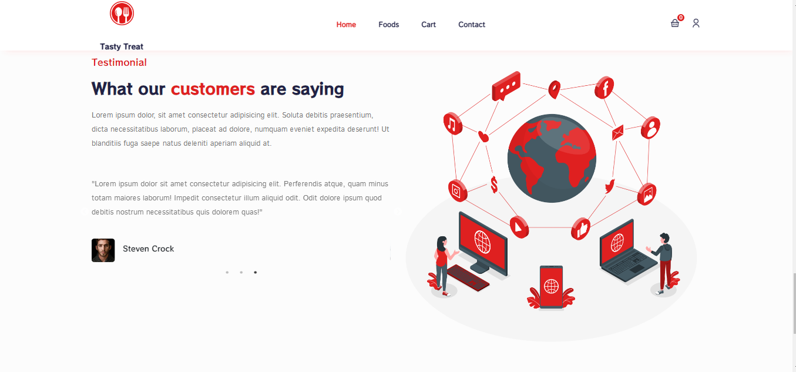
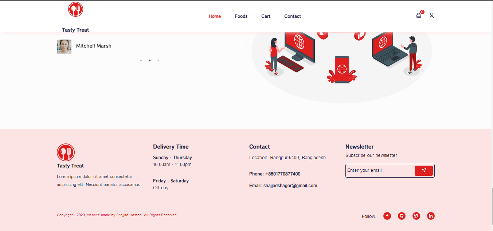
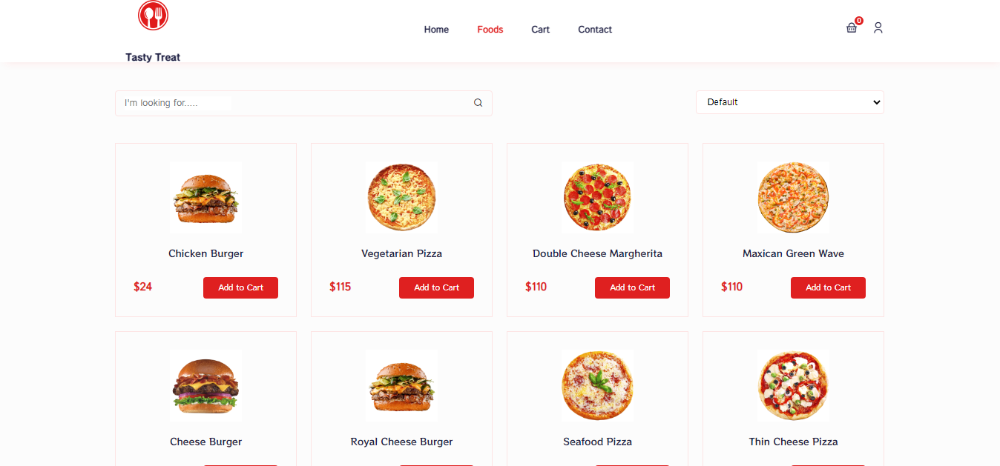
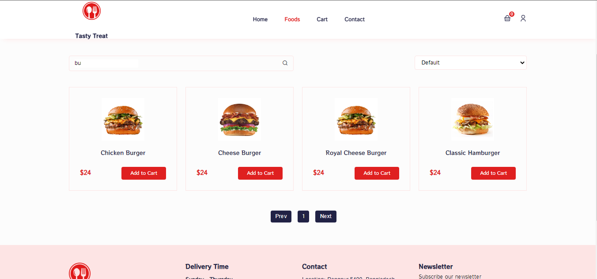
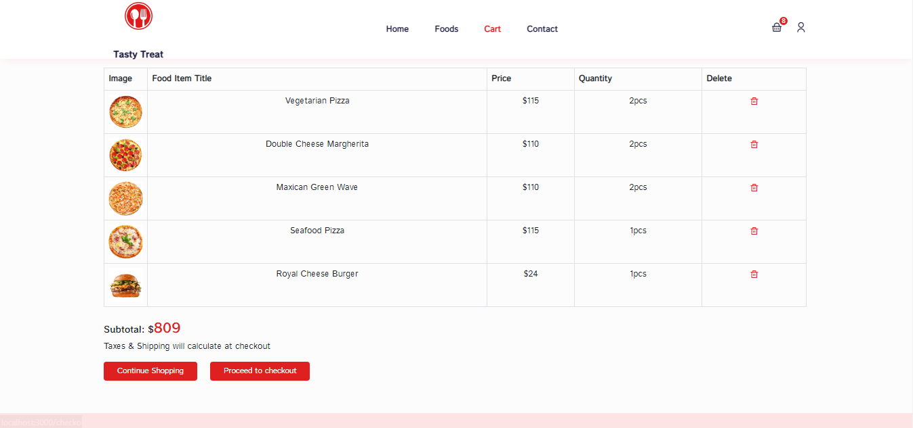
